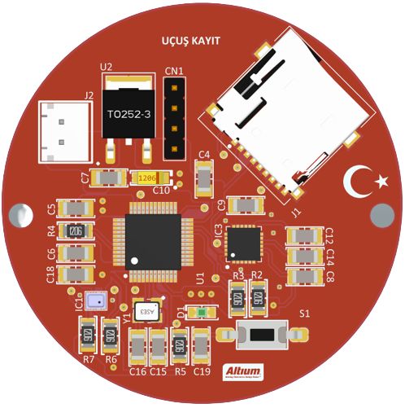
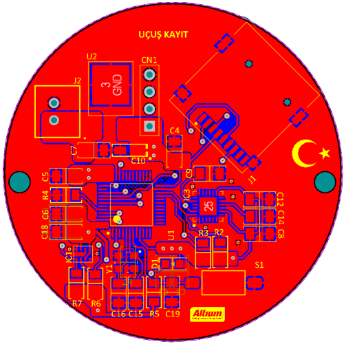

# Uçuş Kayıt

Uçuş Kayit pcb kartı linkteki [kurs](https://www.youtube.com/playlist?list=PL0nSGdzTE4g_wqTei7HLfgDrX8tR8PREq) izlenerek tamamlanmıştır.

- 7-12V ile beslenmekte ve 3.3V güç çıkışı bulunmaktadır.
- İşlemci olarak STM32F103C8T6 kullanılmaktadır.
- Sensör olarak BMP280 basınç sensörü ile MPU6050 ivme sensörü kullanılmıştır.
- Sensörlerden elde edilen veriler SD CARD ile kaydedilmektedir. 
- Kullanıcının kullanabileceği led bulunmaktadır.
- Pcb kartı 2 katmanlı ve 50x50 mm boyutundadır.
 
 

### **3D**  
  

### **Pcb**  
  
